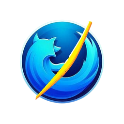

# IFoxer



**IFoxer** は、C# と .NET 9 をベースに開発された、カスタマイズ性と学習のしやすさを重視したオープンソースの軽量ウェブブラウザです。最新のウェブ標準をサポートする `WebView2` をレンダリングエンジンとして採用し、モダンなブラウジング体験を提供します。このプロジェクトは、Windows Forms アプリケーション開発の学習教材として、また、自分だけのブラウザを作りたいと考える開発者のための出発点となることを目指しています。

---

## ✨ 主な機能

IFoxerは、標準的なウェブブラウザが持つべき基本的な機能を網羅しつつ、カスタマイズの余地を残しています。

*   **タブブラウジング**:
    *   直感的なタブの追加、切り替え、クローズ機能。
    *   ドラッグ＆ドロップによるタブの順序変更。
    *   マウスのミドルクリックによるタブクローズ。

*   **ブックマーク管理**:
    *   現在表示しているページを簡単にお気に入りとして登録。
    *   ブックマークの一覧表示と、そこからのページ遷移。

*   **閲覧履歴とダウンロード管理**:
    *   過去に訪れたサイトを追跡し、いつでも再アクセス可能。
    *   ウェブからのファイルダウンロードとその履歴を管理。

*   **高度なカスタマイズ**:
    *   **検索エンジン**: Google, Bing, DuckDuckGoなど、お好みの検索エンジンにいつでも切り替え可能。
    *   **テーマカラー**: アプリケーションのアクセントカラーを自由に変更し、自分だけのデザインを楽しめます。

---

## 💻 技術スタック

このプロジェクトは、以下の技術を組み合わせて構築されています。

*   **C# 12 & .NET 9**: アプリケーションのコアロジックを担う、最新のC#と.NETフレームワーク。
*   **Windows Forms**: デスクトップアプリケーションとしてのUIを構築。
*   **Microsoft Edge WebView2**: Microsoft Edge (Chromium) をベースとしたレンダリングエンジン。HTML, CSS, JavaScriptを高速かつ正確に描画します。
*   **PowerShell**: インストール作業を自動化するカスタムインストーラー。

---

## 🚀 インストールとセットアップ

IFoxerを利用するには、2つの方法があります。

### 方法1: インストーラーを使用する (推奨)

最も簡単で推奨される方法です。

1.  リリースページから最新の `installer.7z` をダウンロードし、解凍します。
2.  解凍後のフォルダにある `install.ps1` を右クリックし、**[PowerShellで実行]** を選択します。
    *   **注意**: スクリプトの実行がブロックされる場合、`Set-ExecutionPolicy -ExecutionPolicy RemoteSigned -Scope Process` をPowerShellで実行してから再度お試しください。
3.  画面に表示されるウィザードに従い、インストール先やショートカットの作成などを設定します。
4.  インストーラーが必要なコンポーネント（.NET 9 SDK, WebView2 Runtime）を自動で検出し、なければインストールを促します。

### 方法2: ソースからビルドする (開発者向け)

ソースコードから直接ビルドし、開発に参加することもできます。

1.  **前提条件**: [.NET 9.0 SDK](https://dotnet.microsoft.com/download/dotnet/9.0) をインストールします。
2.  このリポジトリのソースコードを入手します。
    *   **Gitを使用する場合**:
        ```bash
        git clone https://github.com/your-username/IFoxer.git
        ```
    *   **Gitを使用しない場合**:
        このリポジトリのページ右上にある `Code` ボタンをクリックし、`Download ZIP` を選択してソースコードをダウンロードします。ダウンロード後、ZIPファイルを任意の場所に解凍してください。
3.  プロジェクトのルートディレクトリで、以下のコマンドを実行してビルドします。
    ```bash
    dotnet build
    ```
4.  ビルドが成功すると、`bin/Debug/net9.0-windows/` ディレクトリ内に `IFoxer.exe` が生成されます。これを実行してください。

---

## 💡 基本的な使い方

*   **ナビゲーション**: 上部のアドレスバーにURLを入力してウェブサイトを閲覧します。戻る、進む、再読み込みボタンも利用できます。
*   **設定**: 右上のメニューボタンから設定画面を開き、検索エンジンやテーマカラーの変更ができます。
*   **ブックマーク追加**: アドレスバーの隣にある星マークのボタンを押すと、現在のページをブックマークに追加できます。

---

## 🤝 コントリビュート

このプロジェクトへの貢献を歓迎します！バグ報告、機能提案、プルリクエストなど、どんな形でも構いません。

1.  改善したい点があれば、まずは **Issue** を立てて議論を開始してください。
2.  フォークしてブランチを作成し (`git checkout -b feature/AmazingFeature`)、変更を加えます。
3.  変更をコミットし (`git commit -m 'Add some AmazingFeature'`)、ブランチにプッシュします (`git push origin feature/AmazingFeature`)。
4.  **Pull Request** を作成してください。

---

## 📜 ライセンス

このプロジェクトは **MITライセンス** の下で公開されています。詳細については `LICENSE` ファイルをご覧ください。
